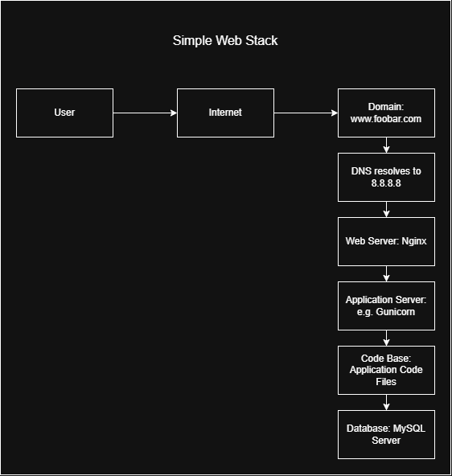
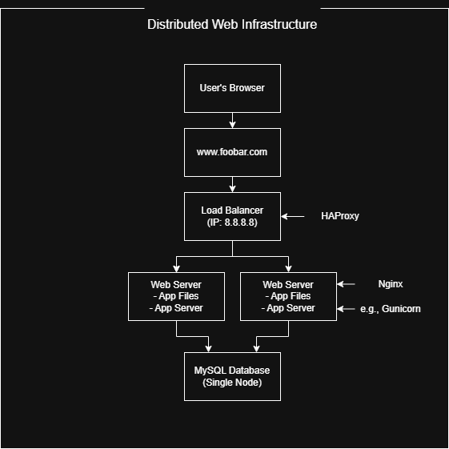
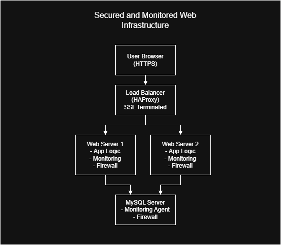
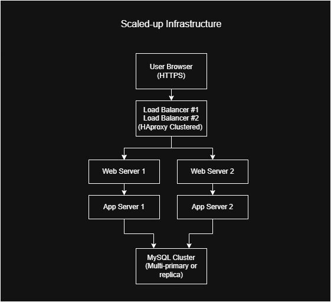

### Diagram Layout

## Explanations

### 1. **What is a server?**

A server is a physical or virtual computer that provides services or resources to other computers (clients). In this case, it's hosting the web app.

### 2. **What is the role of the domain name?**

The domain name (foobar.com) maps a human-readable name to the IP address of the server (8.8.8.8), so users don’t need to remember IPs.

### 3. **What type of DNS record is 'www' in [www.foobar.com](http://www.foobar.com)?**

The `www` is a subdomain, and the DNS record type used is typically an **A record** (Address Record) that maps the name to the server’s IP address (8.8.8.8).

### 4. **What is the role of the web server (Nginx)?**

The web server handles HTTP requests, serves static files (like HTML/CSS), and forwards dynamic requests to the application server.

### 5. **What is the role of the application server?**

The application server (e.g. Gunicorn for Python) runs the backend logic/code (e.g. Flask, Django, Node.js app) and handles dynamic content generation.

### 6. **What is the role of the database (MySQL)?**

The database stores and manages application data, such as user accounts, posts, transactions, etc., and responds to queries from the application server.

### 7. **How does the server communicate with the user’s computer?**

Through the **Internet**, using **TCP/IP protocols** like HTTP/HTTPS over port 80/443. The web server uses HTTP(S) to serve the user’s browser.

---

## Issues with this Infrastructure

* **SPOF (Single Point of Failure):** Only one server. If it fails, everything goes down.
* **Downtime during maintenance:** Restarting the web server to update code will bring down the entire site.
* **Not scalable:** A single server can only handle a limited number of requests. Under heavy traffic, it will crash or become slow.

---
### Diagram Layout

## Explanations

### **Why Each New Element Was Added**

* **Load Balancer (HAproxy)**: Distributes incoming traffic between web servers to improve availability and scalability.
* **Two Web Servers**: To support more traffic and add redundancy—if one fails, the other still serves users.
* **Application Server**: Hosts the backend logic and processes dynamic content.
* **MySQL Database**: Stores and manages persistent data (users, posts, etc.).

---

### **Load Balancer Setup**

* **Distribution Algorithm**: Typically `Round Robin`.

  * Works by sending each new request to the next server in line, looping back to the first after the last.
  * Example: Request 1 → Server A, Request 2 → Server B, Request 3 → Server A, and so on.

---

### **Active-Active vs Active-Passive**

* **Your setup is Active-Active**:

  * Both web servers are running and serving traffic simultaneously.
* **Active-Active**:

  * All servers handle traffic.
  * Better for load sharing and performance.
* **Active-Passive**:

  * One server is idle and only takes over if the active one fails.
  * Used more for high availability/failover, not performance.

---

### **Database Cluster: Primary-Replica (Master-Slave)**

(This setup has only one DB node, but here's how the concept works.)

* **Primary Node**: Handles **writes** (INSERT, UPDATE, DELETE).
* **Replica Node**: Handles **reads** (SELECT), syncing data from the Primary.
* Used to **offload read operations** and for **fault tolerance**.

---

### **Difference Between Primary and Replica**

* **Primary**:

  * Handles read and write operations.
  * Source of truth.
* **Replica**:

  * Only handles read queries.
  * Cannot modify data; syncs from the Primary.

---

## Issues with This Infrastructure

* **SPOF (Single Point of Failure)**:

  * The **load balancer** is a SPOF. If it fails, the site becomes unreachable.
  * The **database** is also a SPOF—no replication yet.
* **Security Issues**:

  * No firewall to control incoming/outgoing access.
  * No HTTPS → data can be intercepted.
* **No Monitoring**:

  * No system in place to detect failures, performance degradation, etc.

---
### Diagram Layout

## Explanations

### **Why Each New Element Was Added**

* **Firewalls (3)**: Each server (web1, web2, DB) has a firewall to restrict incoming and outgoing traffic to only what's necessary (e.g., only allow port 443 for HTTPS).
* **SSL Certificate**: To encrypt communication between the user and your site (HTTPS), ensuring data confidentiality.
* **Monitoring Clients**: Installed on each server to send metrics/logs to an external monitoring service (e.g., Sumologic, Datadog, Prometheus).

---

### **What Are Firewalls For?**

* Block unauthorized access.
* Define allowed traffic rules (e.g., only allow TCP 443 on web servers, TCP 3306 only from app servers to DB).
* First layer of defense against attacks (DDoS, brute-force, etc.).

---

### **Why Serve Over HTTPS?**

* Encrypts communication, protecting sensitive data (e.g., logins, cookies).
* Prevents MITM (Man-in-the-middle) attacks.
* Builds user trust (no browser warning).
* Required for SEO and modern browsers.

---

### **What Is Monitoring Used For?**

* Tracks server health, CPU, memory, disk, QPS, traffic, errors, etc.
* Detects issues early before downtime.
* Helps debugging and performance tuning.
* Can trigger alerts based on thresholds.

---

### **How Monitoring Collects Data**

* A monitoring agent runs on each server.
* It collects logs and metrics (e.g., from Nginx logs, MySQL stats).
* Sends data to a centralized dashboard (like Sumologic, Prometheus, or Datadog).

---

### **How to Monitor Web Server QPS**

* Use tools like:

  * **Nginx logs + custom script** to count requests per second.
  * **Prometheus + Node Exporter + Nginx Exporter**.
  * **Sumologic agent** parsing access logs.
* Set up a graph/dashboard that tracks QPS in real-time or historical view.

---

## Issues in This Infrastructure

### **SSL Termination at Load Balancer**

* **Problem**: SSL is decrypted at the LB, and traffic to web servers is in plain HTTP.
* **Risk**: If internal network is compromised, attacker can sniff data.
* **Fix**: Use **end-to-end encryption** (LB to web servers over HTTPS).

---

### **Only One MySQL Write-Capable Node**

* **Problem**: If the DB crashes, no writes are possible.
* **Risk**: SPOF for all dynamic content creation.
* **Fix**: Use a **replicated setup** with failover (e.g., MySQL Group Replication or Galera).

---

### **Each Server Has All Components (DB, App, Web)**

* **Problem**: Poor separation of concerns, resource contention, and scalability.
* **Example**: A spike in web traffic could affect DB performance.
* **Fix**: Use **role separation**—dedicated DB server, web servers, etc.

---

Great — you're now on **Task 3: Scale Up**. This is the most robust infrastructure so far. You’ll improve **redundancy**, **scalability**, and **separation of concerns** by fully splitting web, app, DB, and load-balancer components.

---

### Diagram Layout

## Explanations

### **Why Each New Element Was Added**

* **Extra Load Balancer (HAproxy Cluster)**:

  * Ensures high availability.
  * If one load balancer fails, the other can take over (failover via keepalived, VRRP, etc.).

* **Dedicated Web Server(s)**:

  * Handles only HTTP(S) requests.
  * Improves maintainability and performance under heavy load.

* **Dedicated Application Server(s)**:

  * Separates business logic (e.g., Python/Node backend) from web server.
  * Allows independent scaling of backend logic.

* **Dedicated Database Server(s)**:

  * Improves security and performance of the DB layer.
  * Can scale DB separately (e.g., through replication, sharding, etc.).

* **New Server Added**:

  * Could serve as:

    * An additional application server (scaling logic layer)
    * A read-replica database
    * A dedicated cache (like Redis)
    * Or a second load balancer (if you were previously using only one)
